# Channel API

APB has no channels in the AXI sense. The Channel API here exposes per-**phase** control rather than per-channel: separate methods for the SETUP phase and the ACCESS phase of each transaction.

## When to use this API

Use the Channel API when the test needs:
- To hold PREADY LOW for an extended interval to verify master DUT timeout behavior.
- To inject illegal handshake sequences (e.g., assert PSLVERR with PREADY LOW; assert PREADY without PENABLE).
- To drive per-cycle deterministic patterns on PREADY rather than the random wait-state range that `set_wait_states` provides.

Otherwise use transaction_api.md.

## API conventions

- Per-phase methods named `<verb>_<phase>` — e.g. `begin_phase_setup`, `wait_for_setup`, `end_phase_setup`, `begin_phase_access`, `assert_pready`, `wait_for_master_observe`, `end_phase_access`.
- Naming: snake_case.
- Error reporting: `status_t` enum; per-method methods return `OK`, `ILLEGAL_PHASE`, `BUSY_TXN_API`, or `RESET_DURING_TRANSACTION`.
- Blocking discipline: only `wait_for_*` methods block.

## Phase state machine

```mermaid
stateDiagram-v2
    [*] --> IDLE
    IDLE --> WAITING_SETUP: begin_phase_setup
    WAITING_SETUP --> SETUP_OBSERVED: wait_for_setup (blocks until PSEL rises with PENABLE LOW)
    SETUP_OBSERVED --> IDLE_BETWEEN: end_phase_setup
    IDLE_BETWEEN --> WAITING_ENABLE: begin_phase_access (drives PRDATA / PSLVERR; PREADY remains LOW)
    WAITING_ENABLE --> READY_ACCEPTED: wait_for_enable + assert_pready (PENABLE rises, then BFM raises PREADY)
    READY_ACCEPTED --> ENDED: wait_for_master_observe (one PCLK after PREADY)
    ENDED --> IDLE: end_phase_access
```

The state machine has more states than the AXI-Lite per-channel state machine (see `references/templates/bfm/03c_channel_api.md` §Channel state machine) because APB explicitly separates SETUP and ACCESS phases at the protocol level.

## Per-phase API

### SETUP phase

| Method                                | Signature                          | Legal in state    | Side effect                                                                                  | Returns                          |
|---------------------------------------|------------------------------------|-------------------|----------------------------------------------------------------------------------------------|----------------------------------|
| begin_phase_setup()                   | void                               | IDLE              | Transition to WAITING_SETUP. No wires driven.                                                | OK or BUSY_TXN_API               |
| wait_for_setup(addr_match=<opt>, write=<opt>) | (status_t, addr, write, wdata)| WAITING_SETUP     | Blocks until PSEL=1 + PENABLE=0 observed. If addr_match supplied, additionally requires PADDR matches. State → SETUP_OBSERVED. Returns observed (PADDR, PWRITE, PWDATA-if-write). | OK or RESET_DURING_TRANSACTION |
| end_phase_setup()                     | void                               | SETUP_OBSERVED    | State → IDLE_BETWEEN. No wires driven.                                                       | OK or ILLEGAL_PHASE              |

### ACCESS phase

| Method                                | Signature                          | Legal in state    | Side effect                                                                                  | Returns                          |
|---------------------------------------|------------------------------------|-------------------|----------------------------------------------------------------------------------------------|----------------------------------|
| begin_phase_access(PRDATA=0, PSLVERR=0) | void(uint64_t, bit)              | IDLE_BETWEEN      | PRDATA driven to supplied value (used for read transactions; for writes PRDATA is ignored). PSLVERR driven to supplied value (one cycle in advance). PREADY remains LOW. State → WAITING_ENABLE. | OK or BUSY_TXN_API |
| wait_for_enable()                     | status_t                           | WAITING_ENABLE    | Blocks until PENABLE rises HIGH. State unchanged (still WAITING_ENABLE until assert_pready). | OK or RESET_DURING_TRANSACTION   |
| assert_pready()                       | void                               | WAITING_ENABLE    | PREADY driven HIGH on the next PCLK rising edge. State → READY_ACCEPTED.                    | OK or ILLEGAL_PHASE              |
| wait_for_master_observe()             | status_t                           | READY_ACCEPTED    | Blocks for exactly one PCLK rising edge (the cycle the master samples PREADY). State → ENDED. | OK or RESET_DURING_TRANSACTION   |
| end_phase_access()                    | void                               | ENDED             | PREADY driven LOW; PRDATA and PSLVERR held until next begin_phase_access. State → IDLE.     | OK or ILLEGAL_PHASE              |

## Ordering constraints with Transaction API

- **Forbidden**: any Channel API method while a Transaction-API call (e.g., `expect_write`) is in flight. Channel-API methods on the bus return `BUSY_TXN_API`.
- **Permitted**: Channel API used in isolation between two Transaction-API calls.
- **Detection**: Channel API methods check the bus-ownership flag. The BFM logs BUSY_TXN_API.

## Behavior under reset

PRESETn asserts → state machine resets to IDLE → any blocked `wait_for_*` calls unblock with `RESET_DURING_TRANSACTION` → outstanding `begin_phase_access` PRDATA/PSLVERR configurations dropped → on PRESETn deassertion, ready for next phase.

## Concurrency rules

APB Channel API is not thread-safe — only one thread should drive the bus at any time. The state machine does not arbitrate concurrent calls.
