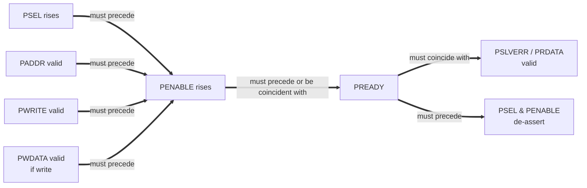

# Channel Handshake & Dependencies

APB has no channels in the AXI sense — a transaction is two phases (SETUP and ACCESS) on a single shared signal set. This file collapses to a single transaction-type sub-section per the convention defined in `references/templates/bfm/02c_channel_handshake.md` for single-channel protocols.

## Arrow convention

Per ARM AMBA AXI Specification §A3.3 (reused for all handshake protocols):
- **Single-headed arrow** (`A --> B`): source signal at A *may* assert before destination signal at B.
- **Double-headed arrow** (`A ==> B`): source signal at A *must* assert before destination signal at B.

## Per-transaction-type dependencies

### APB transaction (SETUP → ACCESS)

#### Dependency diagram

#### Textual dependency list

- PSEL assertion must precede PENABLE assertion. (PSEL=1 + PENABLE=0 = SETUP cycle; PSEL=1 + PENABLE=1 = ACCESS cycle.) Rule: `APB_SLV_SETUP_PSEL_PENABLE` and `APB_SLV_ACCESS_PSEL_PENABLE` in protocol_rules.md.
- PADDR / PWRITE / PWDATA must be valid (stable) from the SETUP cycle through to the ACCESS cycle. Rules: `APB_SLV_PADDR_STABLE`, `APB_SLV_PWRITE_STABLE`, `APB_SLV_PWDATA_STABLE`.
- PENABLE assertion must precede or coincide with PREADY rising. (Slave may have PREADY HIGH-by-default, in which case ACCESS phase completes in one cycle; or PREADY may rise after some wait states — `APB_SLV_CFG_WAIT_STATES_BOUND`.)
- PREADY rising must coincide with valid PSLVERR (if asserted) and valid PRDATA (for reads). Rules: `APB_SLV_PSLVERR_VALID_WITH_PREADY`, `APB_SLV_PRDATA_VALID_WITH_PREADY`.
- PREADY observation must precede the de-assertion of PSEL and PENABLE (or, in the back-to-back case, must precede the SETUP cycle of the next transaction). Rule: `APB_SLV_PSEL_DEASSERT_AFTER_ACCESS`.

#### Deadlock-avoidance commentary

The BFM avoids combinational-ready deadlock by **registering** PREADY — PREADY is never a combinational function of PSEL or PENABLE. APB itself imposes no cross-transaction deadlock risk because APB has no outstanding transactions: at any time, exactly zero or one transaction is in flight, and the master cannot start a second transaction until the slave completes the first. No deadlock mode applies.

## Cross-transaction-type dependencies

(none — APB has only one transaction type. The same SETUP→ACCESS sequence handles both reads and writes, distinguished by PWRITE.)

## Out-of-order completion

APB does not support outstanding transactions — at most one transaction is in flight at any time, and it must complete (PREADY observed HIGH during ACCESS) before the master can start a new transaction. There is no out-of-order semantics to discuss.
