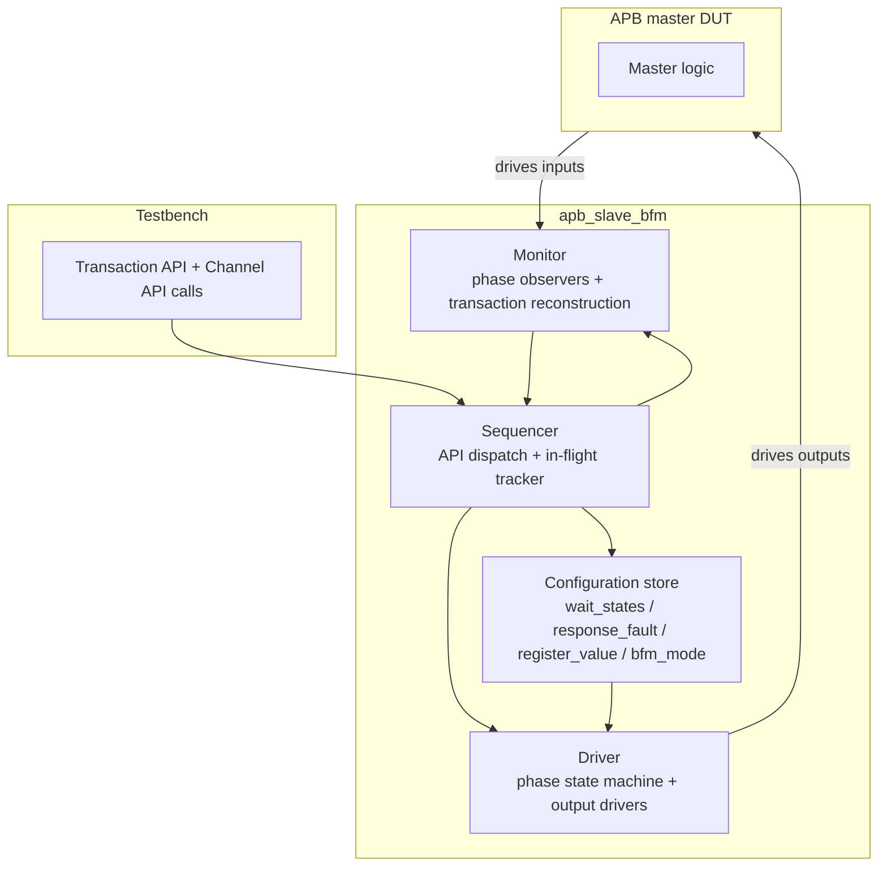

# Theory of Operation

This document describes the BFM's internal architecture — driver, monitor, sequencer; phase state machine; in-flight transaction tracker; configuration storage; reset entry sequencing. The wire-level contract is in `signal_interface.md` and `protocol_rules.md`; the testbench-facing API is in `transaction_api.md` and `channel_api.md`.

## Block diagram



## BFM internal architecture

### Driver

The driver owns a single phase state machine implementing the `IDLE → WAITING_SETUP → SETUP_OBSERVED → IDLE_BETWEEN → WAITING_ENABLE → READY_ACCEPTED → ENDED → IDLE` lifecycle defined in `channel_api.md` §Phase state machine. The driver drives PREADY, PRDATA, PSLVERR on the rising edge of PCLK.

The driver is **fully registered**: every BFM output is a flop output, never a combinational function of an inbound DUT signal. PREADY is registered, never combinational on PSEL or PENABLE.

The driver consumes inputs from:
- The sequencer (which phase to advance, what payload to drive).
- The configuration store (wait_states countdown, response_fault one-shot value).
- The monitor (notification when SETUP / ACCESS phases complete).

In passive mode, the driver disables all output assignments (outputs follow pin_level_reset.md during-reset values).

### Monitor

The monitor samples DUT-driven inputs every PCLK rising edge while the BFM is alive. When a complete SETUP + ACCESS sequence is observed (PSEL rising → PENABLE rising → PREADY observed HIGH), the monitor reconstructs the full transaction (read or write per PWRITE) and:
- Notifies the sequencer.
- Appends the reconstructed transaction to the observed-writes / observed-reads lists.
- Checks against every applicable rule in `protocol_rules.md` and logs / asserts on violations.

Monitor activity is identical in active and passive modes.

### Sequencer

The sequencer is the testbench-API surface (transaction_api.md + channel_api.md). It translates API calls into driver and monitor activity. The sequencer maintains the **in-flight transaction tracker** — APB has at most one transaction at any time, so the tracker is a single state field (IDLE / IN_SETUP / IN_ACCESS).

**Relationship between the in-flight tracker and the channel-API phase state machine**: these are two views of the same in-flight state at different granularities. The in-flight tracker is **coarse** (3 states above) and used internally by the sequencer to enforce single-transaction ownership for Transaction API. The channel-API phase state machine (per `channel_api.md` §Phase state machine) is **fine-grained** (7 states: IDLE / WAITING_SETUP / SETUP_OBSERVED / IDLE_BETWEEN / WAITING_ENABLE / READY_ACCEPTED / ENDED) and exposed to the test author for direct phase-level control. Mapping: tracker `IDLE` corresponds to channel-API `IDLE`; tracker `IN_SETUP` corresponds to channel-API `WAITING_SETUP` or `SETUP_OBSERVED`; tracker `IN_ACCESS` corresponds to channel-API `IDLE_BETWEEN` / `WAITING_ENABLE` / `READY_ACCEPTED` / `ENDED`. The two layers coexist; Transaction API uses the tracker for ownership decisions; Channel API operates on the phase state machine directly.

### Configuration store

A small struct holds:
- `wait_states`: `(min_cycles, max_cycles)` pair, default `(0, 0)`.
- `response_fault`: bool one-shot, default false. Cleared after firing.
- `register_value`: `map<addr, value>` for pre-loaded reads. Persistent until `reset_state()`.
- `bfm_mode`: enum `{ACTIVE, PASSIVE}`, default `ACTIVE`.

The configuration store survives PRESETn. It is cleared by `reset_state()` API only (with the exception of `register_value`, which is preserved per the API contract).

## Wait-state implementation

When the driver enters WAITING_ENABLE state (after SETUP completes and ACCESS begins), it samples a uniformly random integer in `[min_cycles, max_cycles]` from the configuration store. A countdown counter decrements each PCLK cycle while PENABLE is HIGH; on reaching 0, the driver asserts PREADY and transitions to READY_ACCEPTED. The countdown is cancelled if PRESETn asserts mid-count.

## Fault injection implementation

When the driver is about to transition from WAITING_ENABLE to READY_ACCEPTED, it consults the `response_fault` flag. If set, PSLVERR is driven HIGH alongside PREADY; otherwise PSLVERR is driven LOW. Flag-clear is atomic with the PREADY assertion.

## Reset entry sequencing

1. PRESETn asserts (asynchronous). The driver state machine resets to IDLE; PREADY/PRDATA/PSLVERR drive their during-reset values combinationally.
2. While PRESETn is low: in-flight tracker dropped; pending wait-state countdown cancelled; pending response-fault flag cleared; observed-writes/reads lists are NOT cleared (cleared only by `reset_state()` API).
3. PRESETn deasserts on a rising PCLK edge. Driver state machine remains in IDLE; outputs transition to "After reset" values per pin_level_reset.md.
4. Sequencer accepts new API calls.

## Performance commitments

- **Throughput**: APB is inherently serial — one transaction at a time. With `set_wait_states(0, 0)`, each transaction completes in 2 PCLK cycles (SETUP + ACCESS).
- **Latency**: Total transaction = 2 + wait_states_random PCLK cycles.
- **Resource model**: No internal buffering beyond the in-flight transaction's PADDR, PWRITE, PWDATA, PSTRB capture and the read response's PRDATA.

## RTL internal architecture

`MODE.md` declares `has-rtl-counterpart: yes` for this spec — the BFM is paired with an RTL implementation of the same logical block (a synthesizable APB slave with internal register file).

### RTL block structure

```mermaid
flowchart TB
    subgraph RTL[apb_slave (RTL counterpart)]
        DEC[Address decoder<br>PADDR → RegFile index or unmapped]
        REGFILE[Register file<br>configurable size × DATA_WIDTH flop array]
        WMUX[Write enable + PSTRB byte-strobe logic<br>APB4 only]
        RMUX[Read multiplexer]
        FSM[APB phase FSM<br>2-state: IDLE / IN_ACCESS<br>registered PREADY output]
    end
    PADDR --> DEC
    DEC -->|valid index| REGFILE
    DEC -->|unmapped| ERR[PSLVERR=1 path]
    PWDATA & PSTRB --> WMUX
    WMUX --> REGFILE
    REGFILE --> RMUX
    RMUX --> PRDATA
    FSM --> PREADY
```

### RTL pipeline / timing

Single-cycle pipeline. The RTL accepts one transaction every 2 PCLK cycles (SETUP + ACCESS, no wait states). PREADY rises on the same cycle as PENABLE rises (zero wait states by default — RTL has no runtime knob equivalent to the BFM's `set_wait_states`).

Configurable wait states are an RTL parameter `WAIT_STATES_DEFAULT` (default 0, can be set to a fixed integer at synthesis time). At runtime the value is fixed; the BFM's randomised `set_wait_states(min, max)` has no RTL equivalent.

### RTL reset behavior

On `PRESETn` assertion:
- PREADY register resets to 0; PRDATA register resets to all-zero; PSLVERR register resets to 0.
- Register file storage **is NOT cleared** — preserves prior content. (Power-on initial state is determined by `$readmemh` synthesis-time parameter, defaulting to all-zero.)
- Phase FSM resets to IDLE.

### RTL-vs-BFM behavioral equivalence

| BFM feature | RTL counterpart |
|---|---|
| `set_wait_states(min, max)` | **Test-only.** RTL has fixed wait-state count `WAIT_STATES_DEFAULT` (synthesis parameter, default 0). The BFM's randomised range is for stress-testing master DUT timeout behavior; not present in RTL. |
| `set_response_fault()` | **Test-only.** RTL only generates PSLVERR on accesses to unmapped addresses (PADDR not within the register file's index range). The BFM's one-shot fault is for stress-testing master DUT error-handling paths. |
| `set_register_value(addr, value)` | **Test-only convenience.** RTL initial values from `$readmemh` (synthesis-time) or all-zero default. Runtime equivalent is a normal APB write to the same address. |
| `bfm_mode = ACTIVE / PASSIVE` | **Test-only.** RTL is always active. |
| `expect_write` / `expect_read` | **Test-only.** RTL has no method API. |
| BFM's `get_observed_writes` / `get_observed_reads` | **Test-only.** RTL has no observation buffers. |

### RTL implementation notes

- Synthesis target: ASIC 7nm (representative). Register file inferred as flops; for >256-entry configurations, integrator should switch to SRAM macro.
- APB4 PSTRB support is conditional on `HAS_APB4` parameter (matches signal_interface.md). When `HAS_APB4=0`, PSTRB and PPROT inputs tie to 0; write-enable logic ignores PSTRB and writes the full word.
- PSLVERR path: address decoder produces a `mapped` signal; RTL sets PSLVERR = ~mapped during ACCESS phase. No additional fault sources in RTL.
- Lint exemption: none required.
