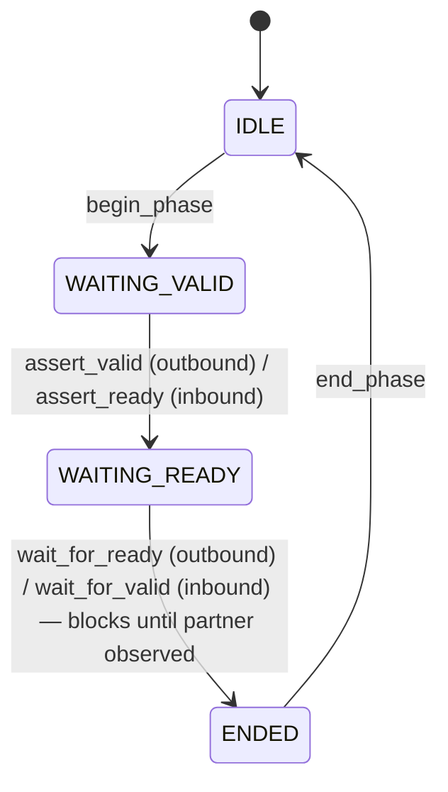

# Channel API

## When to use this API

Use the Channel API when the test needs:
- To assert AWREADY without an accompanying matching response promise (slave back-pressure recovery test).
- To hold WREADY low for an extended interval to verify the master DUT's protocol-rule timeout behavior.
- To inject an illegal handshake sequence (e.g., assert BVALID before any AW handshake) to verify the master DUT's protocol-checker assertions catch the violation.
- To drive a per-cycle pattern on AWREADY (toggling, deterministic delay) rather than the random delay range that `set_response_delay` provides.

Otherwise use transaction_api.md — it is shorter, less error-prone, and covers the typical 95% of tests.

## API conventions

- Per-channel methods named `<verb>_<channel>` — e.g. `begin_phase_AW`, `assert_ready_AW`, `wait_for_valid_AW`, `end_phase_AW`.
- Naming: snake_case.
- Error reporting: `status_t` enum; per-channel methods return `OK`, `ILLEGAL_PHASE`, `BUSY_TXN_API`, or `RESET_DURING_TRANSACTION`.
- Blocking discipline: only `wait_for_*` methods block; all others are non-blocking.

## Channel state machine

All five AXI-Lite channels (AW, W, B, AR, R) use this state machine. The slave BFM drives READY signals on inbound channels (AW, W, AR) and VALID signals on outbound channels (B, R); for inbound channels, `assert_valid` is replaced by `assert_ready`, and `wait_for_ready` by `wait_for_valid`. The state machine is otherwise identical.

## Per-channel API

### AW (write address; inbound to slave BFM)

| Method                                | Signature                          | Legal in state | Side effect                                                               | Returns                          |
|---------------------------------------|------------------------------------|----------------|---------------------------------------------------------------------------|----------------------------------|
| begin_phase_AW()                      | void                               | IDLE           | Transition to WAITING_VALID. No wires driven (AW is inbound; the BFM drives only AWREADY).| OK or BUSY_TXN_API |
| assert_ready_AW()                     | void                               | WAITING_VALID  | AWREADY driven HIGH on the next ACLK rising edge. State → WAITING_READY.   | OK or ILLEGAL_PHASE              |
| wait_for_valid_AW(addr_match=<opt>)   | (status_t, addr, prot)             | WAITING_READY  | Blocks until AWVALID is observed HIGH on a rising ACLK edge. If `addr_match` is provided, the BFM additionally requires AWADDR == addr_match (otherwise the wait continues for the next AWVALID). State → ENDED. Returns observed (addr, prot). | OK or RESET_DURING_TRANSACTION   |
| end_phase_AW()                        | void                               | ENDED          | AWREADY driven LOW on the next ACLK rising edge. State → IDLE.             | OK or ILLEGAL_PHASE              |

### W (write data; inbound to slave BFM)

| Method                                | Signature                          | Legal in state | Side effect                                                               | Returns                          |
|---------------------------------------|------------------------------------|----------------|---------------------------------------------------------------------------|----------------------------------|
| begin_phase_W()                       | void                               | IDLE           | Transition to WAITING_VALID. No wires driven (W is inbound).              | OK or BUSY_TXN_API               |
| assert_ready_W()                      | void                               | WAITING_VALID  | WREADY driven HIGH on the next ACLK rising edge. State → WAITING_READY.   | OK or ILLEGAL_PHASE              |
| wait_for_valid_W()                    | (status_t, data, strb)             | WAITING_READY  | Blocks until WVALID is observed HIGH. State → ENDED. Returns observed (WDATA, WSTRB). | OK or RESET_DURING_TRANSACTION   |
| end_phase_W()                         | void                               | ENDED          | WREADY driven LOW on the next ACLK rising edge. State → IDLE.             | OK or ILLEGAL_PHASE              |

### B (write response; outbound from slave BFM)

| Method                          | Signature                       | Legal in state | Side effect                                                | Returns                          |
|---------------------------------|---------------------------------|----------------|------------------------------------------------------------|----------------------------------|
| begin_phase_B(BRESP)            | void(uint2_t)                   | IDLE           | BRESP driven to the supplied value on the next ACLK edge. State → WAITING_VALID. | OK or BUSY_TXN_API |
| assert_valid_B()                | void                            | WAITING_VALID  | BVALID driven HIGH. State → WAITING_READY.                                       | OK or ILLEGAL_PHASE |
| wait_for_ready_B()              | status_t                        | WAITING_READY  | Blocks until BREADY observed HIGH. State → ENDED.                                | OK or RESET_DURING_TRANSACTION |
| end_phase_B()                   | void                            | ENDED          | BVALID driven LOW; BRESP held until next begin_phase_B. State → IDLE.            | OK or ILLEGAL_PHASE |

### AR (read address; inbound to slave BFM)

| Method                                | Signature                          | Legal in state | Side effect                                                               | Returns                          |
|---------------------------------------|------------------------------------|----------------|---------------------------------------------------------------------------|----------------------------------|
| begin_phase_AR()                      | void                               | IDLE           | Transition to WAITING_VALID. No wires driven (AR is inbound).              | OK or BUSY_TXN_API               |
| assert_ready_AR()                     | void                               | WAITING_VALID  | ARREADY driven HIGH on the next ACLK rising edge. State → WAITING_READY.  | OK or ILLEGAL_PHASE              |
| wait_for_valid_AR(addr_match=<opt>)   | (status_t, addr, prot)             | WAITING_READY  | Blocks until ARVALID is observed HIGH. State → ENDED. Returns observed (addr, prot). | OK or RESET_DURING_TRANSACTION   |
| end_phase_AR()                        | void                               | ENDED          | ARREADY driven LOW on the next ACLK rising edge. State → IDLE.             | OK or ILLEGAL_PHASE              |

### R (read data; outbound from slave BFM)

| Method                          | Signature                       | Legal in state | Side effect                                                | Returns                          |
|---------------------------------|---------------------------------|----------------|------------------------------------------------------------|----------------------------------|
| begin_phase_R(RDATA, RRESP)     | void(uint64_t, uint2_t)         | IDLE           | RDATA and RRESP driven to the supplied values on the next ACLK edge. State → WAITING_VALID. | OK or BUSY_TXN_API |
| assert_valid_R()                | void                            | WAITING_VALID  | RVALID driven HIGH. State → WAITING_READY.                                       | OK or ILLEGAL_PHASE |
| wait_for_ready_R()              | status_t                        | WAITING_READY  | Blocks until RREADY observed HIGH. State → ENDED.                                | OK or RESET_DURING_TRANSACTION |
| end_phase_R()                   | void                            | ENDED          | RVALID driven LOW; RDATA/RRESP held until next begin_phase_R. State → IDLE.       | OK or ILLEGAL_PHASE |

## Ordering constraints with Transaction API

- **Forbidden**: any Channel API method on a channel that is currently being driven by a Transaction API call. While `expect_write` is blocked, the AW, W, and B channels are owned by Transaction API; Channel API methods on those channels return `BUSY_TXN_API`. While `expect_read` is blocked, AR and R channels are owned.
- **Permitted**: Channel API on AR/R while `expect_write` is blocked on AW/W/B is legal — the channels are independent.
- **Detection**: every Channel API method checks the per-channel ownership flag before acting. The BFM logs the BUSY_TXN_API return so user bugs are visible.

## Behavior under reset

ARESETn asserts → all channel state machines reset to IDLE → any blocked `wait_for_*` calls unblock with status `RESET_DURING_TRANSACTION` → outstanding `begin_phase_B(BRESP)` / `begin_phase_R(RDATA, RRESP)` field configurations are dropped → on ARESETn deassertion, the channels are clean and ready for the next phase.

## Concurrency rules

Per-channel methods on different channels may be called concurrently from separate testbench threads. Per-channel methods on the same channel must be called from a single thread; the channel's state machine is not thread-safe and concurrent calls produce undefined behavior (no error returned, but state transitions race).
