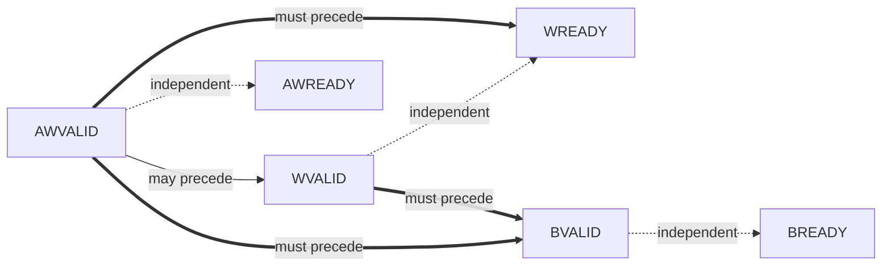
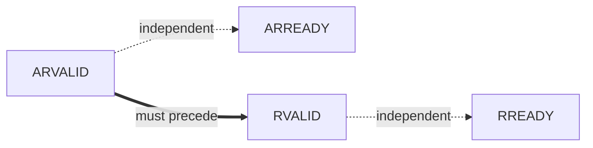

# Channel Handshake & Dependencies

## Arrow convention

Per ARM AMBA AXI Specification §A3.3 (reuse for all handshake protocols):
- **Single-headed arrow** (`A --> B`): source signal at A *may* assert before destination signal at B. Permissive.
- **Double-headed arrow** (`A ==> B`): source signal at A *must* assert before destination signal at B. Mandatory; reversal is a protocol violation and corresponds to an `XCH` rule in `protocol_rules.md`.

## Per-transaction-type dependencies

### Write transaction (AW + W → B)

#### Dependency diagram

#### Textual dependency list

- AWVALID assertion may precede WVALID assertion. (Master may start the address phase before, simultaneous with, or after the data phase.)
- AWVALID assertion may precede or follow AWREADY assertion. (Both VALID-before-READY and READY-before-VALID handshake orders are legal per AXI4-Lite §A3.3.)
- WVALID assertion may precede or follow WREADY assertion. (Same reasoning.)
- AWVALID handshake completion must precede WREADY assertion for the corresponding write. The slave does not accept W before AW. Rule: `AXI4LITE_SLV_XCH_W_AFTER_AW` in protocol_rules.md.
- AWVALID handshake completion must precede BVALID assertion. Rule: `AXI4LITE_SLV_XCH_B_AFTER_AW_AND_W`.
- WVALID handshake completion must precede BVALID assertion. Rule: `AXI4LITE_SLV_XCH_B_AFTER_AW_AND_W`.
- BVALID assertion may precede or follow BREADY assertion.

#### Deadlock-avoidance commentary

The BFM avoids the AXI-Lite combinational-ready deadlock by **registering** AWREADY, WREADY, and BVALID. None of the BFM's READY/VALID outputs is a combinational function of an inbound VALID/READY input from the DUT. This is a hard rule for the BFM — see `theory_of_operation.md` §Internal architecture.

The BFM does **not** chain WREADY back-pressure to BREADY: WREADY is held low only until the AW phase completes for the corresponding write; WREADY is **not** gated by whether the previous B has been acked. This avoids a W↔B chain deadlock where master holds BREADY low waiting for data and slave holds WREADY low waiting for B-ack.

### Read transaction (AR → R)

#### Dependency diagram

#### Textual dependency list

- ARVALID assertion may precede or follow ARREADY assertion.
- ARVALID handshake completion must precede RVALID assertion. Rule: `AXI4LITE_SLV_XCH_R_AFTER_AR`.
- RVALID assertion may precede or follow RREADY assertion.

#### Deadlock-avoidance commentary

ARREADY and RVALID are both registered (no combinational dependency on inbound DUT signals). ARREADY is held low only when a read is already in flight (waiting for that read's RVALID handshake to complete) — see `AXI4LITE_SLV_XCH_NO_OUTSTANDING_READ`. No deadlock mode applies for reads in isolation; the only potential deadlock involves a master that holds RREADY low indefinitely, which is the master's contract violation, not the slave's.

## Cross-transaction-type dependencies

(none — AXI4-Lite imposes no ordering between independent reads and writes. The BFM may have a write and a read in flight simultaneously; their phases on AW/W/B and AR/R proceed independently.)

## Out-of-order completion

AXI4-Lite does not support outstanding transactions: at most one write and at most one read may be in flight, and they complete in the order they were issued. This BFM enforces single-outstanding semantics — a second write is back-pressured at AWREADY until the first write has completed (BVALID handshake), and similarly for reads. See protocol_rules.md `AXI4LITE_SLV_XCH_NO_OUTSTANDING_WRITE` and `AXI4LITE_SLV_XCH_NO_OUTSTANDING_READ`.
