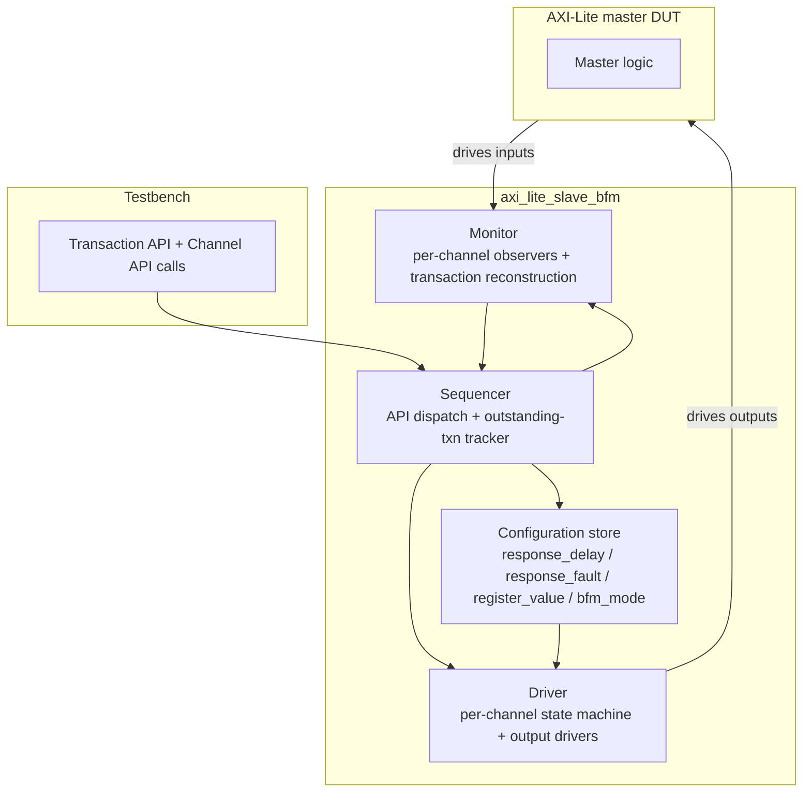

# Theory of Operation

This document describes the BFM's internal architecture — the driver, monitor, and sequencer blocks; per-channel state machines; in-flight transaction trackers; configuration storage; and reset entry sequencing. The wire-level contract is in `signal_interface.md` and `protocol_rules.md`; the testbench-facing API is in `transaction_api.md` and `channel_api.md`. This file complements those by describing **how the BFM internals are structured** so a re-implementer in a different language (SystemC, native UVM, pure VHDL) can produce a behaviorally equivalent BFM.

## Block diagram



## BFM internal architecture

### Driver

The driver owns five per-channel state machines (one each for AW, W, B, AR, R), each implementing the `IDLE → WAITING_VALID → WAITING_READY → ENDED → IDLE` lifecycle defined in `channel_api.md` §Channel state machine. Each state machine drives its channel's outputs (READY for inbound channels AW/W/AR; VALID + payload for outbound channels B/R) on the rising edge of ACLK.

The driver is **fully registered**: every BFM output is a flop output, never a combinational function of an inbound DUT signal. This is the load-bearing implementation choice that prevents the AXI-Lite combinational-ready deadlock — see `channel_handshake.md` §Deadlock-avoidance commentary.

The driver consumes inputs from:
- The sequencer (which channel state machine to advance, and what payload to drive on B/R).
- The configuration store (response_delay countdown, response_fault one-shot value).
- The monitor (notification when AW/W/AR phases complete, so the next phase can start).

In passive mode, the driver disables all output assignments (outputs follow pin_level_reset.md during-reset values). The five state machines remain in IDLE.

### Monitor

The monitor owns five per-channel observers, each sampling its channel's inputs every ACLK rising edge while in the appropriate handshake state. When a complete VALID + READY handshake is observed, the monitor reconstructs the full transaction (AW + W → write transaction; AR + R-supplied-by-driver → read transaction) and:
- Notifies the sequencer (so blocked `expect_*` calls can resolve).
- Appends the reconstructed transaction to the observed-writes / observed-reads lists (accessible via `get_observed_writes` / `get_observed_reads`).
- Checks the transaction against every applicable rule in `protocol_rules.md` and logs / asserts on any violation.

Monitor activity is **identical in active and passive modes** — observation is independent of driving.

### Sequencer

The sequencer is the testbench-API surface (transaction_api.md + channel_api.md). It translates API calls into driver and monitor activity:
- `expect_write(addr, data)` → tells the monitor to wake the calling thread when a write to addr is observed; instructs the driver to drive B per current configuration.
- `set_response_delay(min, max)` → updates the configuration store; no immediate driver / monitor activity.
- Channel API calls → directly poke the driver's state machines; bypass the monitor's transaction-reconstruction layer.

The sequencer maintains the **outstanding-transaction tracker** that enforces single-outstanding semantics: at most one write (AW + W → B in flight) and at most one read (AR → R in flight). When a second write or read is requested while the first is in flight, the sequencer back-pressures by holding the relevant READY low (corresponds to protocol_rules.md `AXI4LITE_SLV_XCH_NO_OUTSTANDING_*`).

**Relationship between the outstanding-transaction tracker and the channel-API state machines**: these are two views of the same in-flight state at different granularities. The outstanding-transaction tracker is **coarse** (4 states: WRITE_IDLE / WRITE_IN_FLIGHT × READ_IDLE / READ_IN_FLIGHT) and used internally by the sequencer to enforce single-outstanding ownership for Transaction API. The channel-API state machines (per `channel_api.md` §Channel state machine) are **fine-grained** (5 channels × `IDLE → WAITING_VALID → WAITING_READY → ENDED → IDLE`) and exposed to the test author for direct phase-level control. Mapping: tracker `WRITE_IN_FLIGHT` corresponds to *any* of AW/W/B channel-API states being non-IDLE; `READ_IN_FLIGHT` corresponds to *any* of AR/R channel-API states being non-IDLE. The two layers coexist; Transaction API uses the tracker for back-pressure decisions; Channel API operates on the per-channel state machines directly.

### Configuration store

A small struct holds:
- `response_delay`: `(min_cycles, max_cycles)` pair, default `(0, 0)`.
- `response_fault`: enum `{NONE, SLVERR, DECERR}`, one-shot, default `NONE`. Cleared after the next response handshake fires.
- `register_value`: `map<addr, value>` for pre-loaded reads. Persistent until `reset_state()`.
- `bfm_mode`: enum `{ACTIVE, PASSIVE}`, default `ACTIVE`.

The configuration store survives ARESETn (it is testbench-side state). It is cleared by `reset_state()` API, not by wire-level reset.

## Response delay implementation

When the driver's B or R state machine enters `WAITING_VALID` (after the corresponding inbound phase completes), it samples a uniformly random integer in `[min_cycles, max_cycles]` from the configuration store. A countdown counter decrements each ACLK cycle; on reaching 0, the state machine asserts BVALID/RVALID and transitions to `WAITING_READY`. The countdown is cancelled if ARESETn asserts mid-count.

## Fault injection implementation

When the driver's B or R state machine is about to drive BRESP/RRESP, it consults the `response_fault` flag in the configuration store:
- `NONE` → drive `2'b00` (OKAY).
- `SLVERR` → drive `2'b10` (SLVERR), then clear the flag.
- `DECERR` → drive `2'b11` (DECERR), then clear the flag.

The flag clear is atomic with the BVALID/RVALID assertion — concurrent `set_response_fault` calls during a fault-pending state are queued.

## Reset entry sequencing

1. ARESETn asserts (asynchronous). All five driver state machines reset to IDLE; all per-channel BFM outputs follow pin_level_reset.md "During reset" values combinationally.
2. While ARESETn is low: outstanding-transaction trackers are dropped; pending response_delay countdowns are cancelled; pending response_fault flag is cleared; observed-writes and observed-reads lists are **not** cleared (they are observation history, surviving wire-level reset; cleared only by `reset_state()` API).
3. ARESETn deasserts on a rising ACLK edge. Driver state machines remain in IDLE; on the same cycle, BFM outputs transition to pin_level_reset.md "After reset" values.
4. Sequencer accepts new API calls. Default mode is whatever was last set (ACTIVE on first reset after instantiation).

## Performance commitments

- **Throughput**: Single-outstanding semantic per direction. With `set_response_delay(0, 0)` and `set_response_fault(NONE)`, the BFM completes one full write or read in 2 ACLK cycles minimum (one cycle for AW/AR handshake, one cycle for W/R-or-B handshake — when master DUT raises VALID immediately and BFM raises READY in the same cycle).
- **Latency**: Write transaction (AW issue → B handshake): 1 + max(1, response_delay_random) ACLK cycles. Read transaction (AR issue → R handshake): same formula.
- **Resource model**: The BFM has no internal buffering beyond the single in-flight write transaction's WDATA + WSTRB capture and the read response's RDATA. No fan-in queuing.

## RTL internal architecture

`MODE.md` declares `has-rtl-counterpart: yes` for this spec — the BFM is paired with an RTL implementation of the same logical block (a synthesizable AXI-Lite slave with internal register file).

### RTL block structure

```mermaid
flowchart TB
    subgraph RTL[axi_lite_slave (RTL counterpart)]
        DEC[Address decoder<br>AWADDR / ARADDR → RegFile index]
        REGFILE[Register file<br>1024 × DATA_WIDTH flop array]
        WMUX[Write enable + byte-strobe logic]
        RMUX[Read multiplexer]
        FSM[AXI handshake FSM<br>per-channel registered outputs]
    end
    AWADDR & ARADDR --> DEC
    DEC --> REGFILE
    AWADDR & WDATA & WSTRB --> WMUX
    WMUX --> REGFILE
    REGFILE --> RMUX
    RMUX --> RDATA
    FSM -->|AWREADY / WREADY / BVALID / BRESP / ARREADY / RVALID / RRESP| OUTPUTS[AXI outputs]
```

### RTL pipeline / timing

Single-cycle pipeline:
- AR handshake on cycle N → RDATA available on cycle N+1 (read combinationally from register file via address decoder + RMUX).
- AW + W handshakes complete on cycles N1, N2 → register file write on cycle max(N1, N2)+1 → BVALID on cycle max(N1, N2)+1.

Fixed timing. The RTL has no runtime-configurable response delay equivalent to the BFM's `set_response_delay`.

### RTL reset behavior

On `ARESETn` assertion:
- AXI handshake registers (AWREADY, WREADY, BVALID, ARREADY, RVALID) reset to 0.
- Register file storage **is NOT cleared** — it preserves prior content. (If the synthesis target requires deterministic boot state, the integrator instantiates the slave with a `$readmemh`-loaded initial-content file at synthesis time.)
- Internal in-flight-transaction tracker resets to IDLE.

### RTL-vs-BFM behavioral equivalence

| BFM feature | RTL counterpart |
|---|---|
| `set_response_delay(min, max)` | **Test-only.** RTL has fixed 1-cycle response. The BFM knob exists to model worst-case slave latency for master DUT verification; no RTL equivalent. |
| `set_response_fault(SLVERR \| DECERR)` | **Test-only.** RTL only generates SLVERR for accesses to unmapped addresses (PADDR ≥ register-file size). RTL never generates DECERR — that propagates from upstream interconnect, not from this slave. |
| `set_register_value(addr, value)` | **Test-only convenience.** RTL initial values come from `$readmemh` at synthesis, or default to all-zero. Runtime equivalent is a normal AXI write to the same address. |
| `bfm_mode = ACTIVE / PASSIVE` | **Test-only.** RTL is always active — it always drives its outputs. There is no passive RTL slave. (Passive monitoring is the BFM's role only.) |
| `expect_write` / `expect_read` | **Test-only.** RTL is the responder under test in some scenarios and the responder under verification in others; it does not have a method API. |
| BFM's `get_observed_writes` / `get_observed_reads` | **Test-only.** RTL has no observation buffers; all observation happens via the BFM (when the BFM is in passive mode) or via top-level scoreboards. |

### RTL implementation notes

- Synthesis target: ASIC 7nm (representative). Register file inferred as flops; sized 1024 entries — for larger configurations, integrator should switch to SRAM macro.
- Lint exemption (`WIDTH_TRUNC` on AWADDR upper bits): intentional. AWADDR is parameterised to ADDR_WIDTH but the register-file index uses only the lower 10 bits; upper bits are validated by the address decoder and excess produces SLVERR.
- Clock-gating opportunity: the register file write port can be clock-gated when no AW + W handshake is in flight; left to the integrator's clock-gating insertion pass, not enforced in RTL source.
