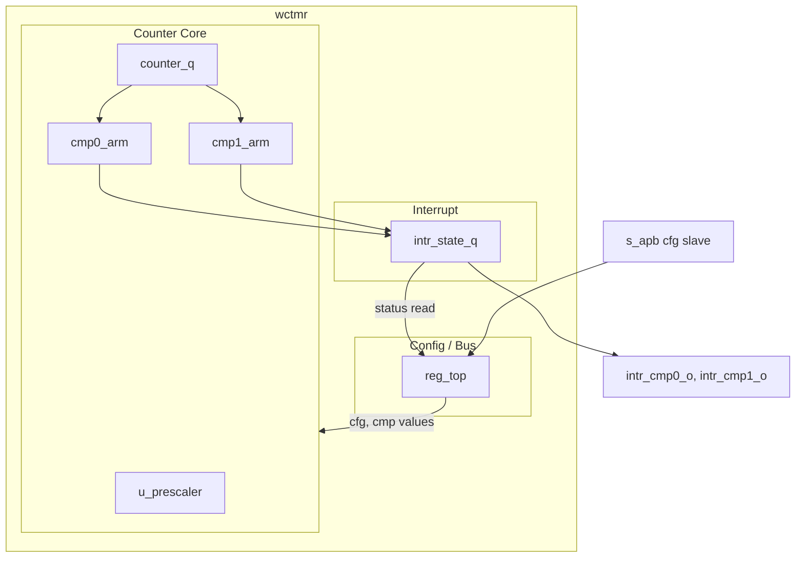

# Theory of Operation

## Block Diagram

The block has three internal regions:
- **Config / Bus** (`reg_top`): the APB slave register file. Holds CTRL, INTR_ENABLE, compare values, and surfaces STATUS and INTR_STATE for read-back.
- **Counter Core**: the prescaler (`u_prescaler`) feeding the 64-bit counter (`counter_q`). Two compare arms (`cmp0_arm`, `cmp1_arm`) watch the counter.
- **Interrupt**: the sticky interrupt-state flops (`intr_state_q`) that drive the level-type `intr_*_o` outputs through the INTR_ENABLE mask.

## Datapath

The counter datapath is straightforward:

1. The prescaler `u_prescaler` is a 16-bit free-running modulo counter. Its tick output asserts for one `clk_i` cycle each time the prescaler completes its programmed period. Period = `2^CTRL.prescale_log2`. `prescale_log2 = 0` configures direct increment with no prescaler division.
2. The 64-bit `counter_q` increments by 1 on every `clk_i` cycle in which the prescaler tick is high AND `CTRL.enable` is 1 AND no software write to `CNT_LO` is occurring (see Software write atomicity below).
3. Each compare arm computes `counter_q >= CMPx` (unsigned 64-bit comparison). The comparison fires for the cycle following the cycle in which `counter_q` first satisfies the inequality. When fired AND `CTRL.cmpx_en` is 1, the corresponding `INTR_STATE.cmpx_match` bit is set sticky.
4. `intr_cmpx_o` (level-type) is driven by `INTR_STATE.cmpx_match & INTR_ENABLE.cmpx_match`. It deasserts only when software writes 1 to `INTR_STATE.cmpx_match` to clear it.

### Software write atomicity

A 64-bit counter is written by software in two 32-bit transactions: `CNT_LO` then `CNT_HI`. To prevent the counter from incrementing between the two writes (which would corrupt the 64-bit value), the increment is suppressed for one cycle following any APB write to `CNT_LO`. Software is expected to write `CNT_LO` first, then `CNT_HI` immediately after; if more than one cycle elapses between the two writes, the new `CNT_HI` is paired with a `CNT_LO` that has already incremented.

This pattern is asymmetric on the read side: a 64-bit read also occurs as `CNT_LO` then `CNT_HI`, and the counter does not freeze during a read. To get a coherent 64-bit value, software either (a) freezes the counter via `CTRL.enable=0` first, or (b) uses the carry-detection idiom in the Programmer's Guide.

## Control / FSM

wctmr has no explicit FSM. The control logic is purely combinational over the register state:

| Signal              | Source                                                     |
|---------------------|------------------------------------------------------------|
| counter_increment   | `CTRL.enable & prescale_tick & ~cnt_lo_write_pending`      |
| cmp0_match (event)  | rising edge of `(counter_q >= CMP0) & CTRL.cmp0_en`        |
| cmp1_match (event)  | rising edge of `(counter_q >= CMP1) & CTRL.cmp1_en`        |
| intr_cmp0_o         | `INTR_STATE.cmp0_match & INTR_ENABLE.cmp0_match`           |
| intr_cmp1_o         | `INTR_STATE.cmp1_match & INTR_ENABLE.cmp1_match`           |
| STATUS.running      | `CTRL.enable`                                              |
| STATUS.cmp0_armed   | `CTRL.cmp0_en`                                             |
| STATUS.cmp1_armed   | `CTRL.cmp1_en`                                             |

## Resets

wctmr has a single reset, `rst_ni`. It is synchronous to `clk_i`, active-low. After deassertion:

- `counter_q` = `64'h0`
- `CTRL` = `32'h0` (block disabled, prescaler at 1, compares disabled)
- `CMP0` = `64'h0`, `CMP1` = `64'h0`
- `INTR_STATE` = `2'b00`
- `INTR_ENABLE` = `2'b00`
- `cnt_lo_write_pending` = `1'b0`

The counter does not increment until software writes `CTRL.enable = 1`, even though `rst_ni` has deasserted.

There is no software-to-block reset register. Software can clear the counter by writing 0 to `CNT_LO` then `CNT_HI`. There is no path to clear the entire block other than asserting `rst_ni`.

If `rst_ni` asserts during an APB transaction, wctmr drops the transaction. `pready_o`, `prdata_o`, and `pslverr_o` return to their reset values within one `clk_i` cycle of `rst_ni` being sampled low. Because the slave's outputs go away mid-handshake, the requestor's view of that transaction is undefined; software must treat any transaction outstanding when reset asserts as having neither completed nor errored, and must re-issue after reset deassertion.

## Clock domains and CDC

wctmr is single-clock-domain. The APB slave operates on `clk_i`. Synchronization between the host bus and `clk_i`, if needed, is the responsibility of the bus adapter outside this block. There are no internal CDC paths.

wctmr places no constraint on the relative frequency of `clk_i` and any external host bus clock. Any frequency relationship is permitted (synchronous, asynchronous, integer ratio, irrational ratio); the integration-level bus adapter handles synchronization without involvement from wctmr.

## Power domains

wctmr is single-power-domain. The block does not implement retention, isolation, or always-on regions.

## Error and fault handling

wctmr has minimal error reporting:

| Condition                                     | Block reaction                              | Software-visible effect           |
|-----------------------------------------------|---------------------------------------------|-----------------------------------|
| APB write to unmapped offset within window    | APB returns PSLVERR                         | Bus error response                |
| APB sub-word write (byte or half-word)        | APB returns PSLVERR; register state unchanged | Bus error response              |
| APB read from unmapped offset within window   | Returns 0; PSLVERR                          | Bus error response, value 0       |
| Counter compare value missed due to wrap      | None                                        | None — see Programmer's Guide     |
| Two compares fire on the same cycle           | Both INTR_STATE bits set in the same cycle  | Software sees both pending        |

The block does not detect or report:
- Counter overflow (wrap-around). This is normal operation, not an error.
- Software writing to `CNT_LO`/`CNT_HI` while the block is enabled. The write completes; the counter discontinuity is software's responsibility.

No error condition listed in the table above latches wctmr into a stuck state. Each error is per-transaction; the block returns to normal operation on the cycle following the offending input. `rst_ni` is never required to recover from a wctmr-detectable error.

## Performance

- Sustained throughput: one counter increment per `clk_i` cycle when prescaler = 1 and block enabled, except for one-cycle pauses following each `CNT_LO` software write.
- APB latency: register reads complete in 2 PCLK cycles (setup + access); writes in 2 cycles. No back-pressure beyond what APB protocol mandates.
- No formal performance commitment beyond the above.

## Security countermeasures

wctmr is not on a security-critical path and implements no security countermeasures.
