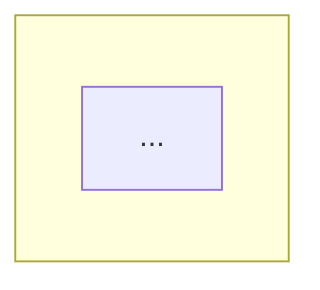
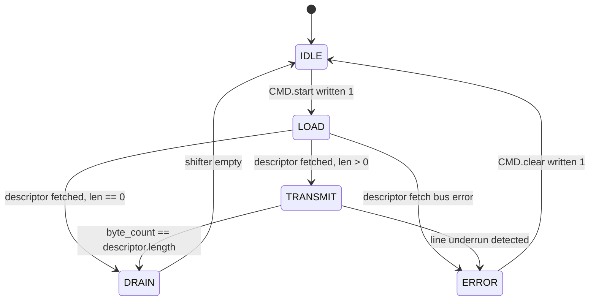
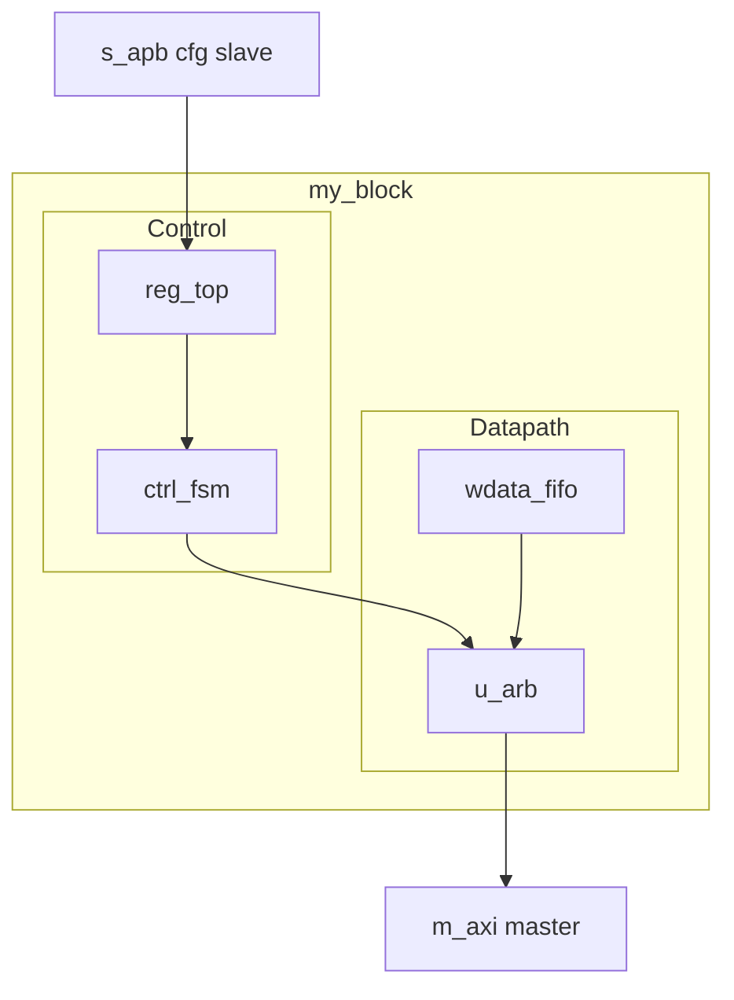

# Template: theory_of_operation.md

**Primary audience:** Hardware designer (implementer), DV engineer (testbench author), SW engineer (driver author).
**Goal:** A reader can understand *how* the block works internally, well enough to predict its behavior on any input and to know what corner cases need testing.

This is the most important document in the spec. If only one file gets the author's attention, it should be this one.

## Required structure

````
# Theory of Operation

## Block Diagram

(Use Mermaid for inline rendering, or reference an SVG file. Pick one.)



OR:


<2–4 sentences walking the reader through the diagram:
name the major sub-blocks, the data path, and the control path.
Reference signal names from interfaces.md but do not redefine them.>

## Datapath

<Describe how data moves through the block, end to end. For each stage:
- What sub-block is active
- What transformation happens
- What timing applies (combinational, single-cycle registered, multi-cycle, pipelined)
- What back-pressure mechanism applies, if any>

## Control / FSM

<For every state machine in the block, give:
- A list of states and what each represents
- The transition table or transition diagram
- Which registers and outputs change on each transition
- The reset state>

If the block has more than one FSM, sub-section each one. Name them after their RTL signal: `### main_ctrl_fsm`, not `### Main FSM`.

## Resets

<Enumerate every reset in the block:
- Name (matching RTL: e.g. rst_ni)
- Active level
- Synchronous or asynchronous
- Source domain
- What state the block is in immediately after deassertion
- Which registers are reset and which are not (e.g., RAM contents typically are not)>

## Clock domains and CDC

<If the block has more than one clock domain:
- Name each domain (matching RTL: clk_core_i, clk_bus_i, ...)
- Identify every signal that crosses domains
- For each crossing, name the synchronizer or handshake used
- Note any constraints on relative frequency

If the block is single-domain, write one sentence stating that and move on.>

## Power domains

<If the block has any always-on, retention, or power-gated regions:
- Identify them
- State which signals must be isolation-clamped at gate boundaries
- State the wake/sleep handshake protocol

If the block is single-power-domain, write one sentence stating that and move on.>

## Error and fault handling

<For each error condition the block can detect:
- The triggering condition (in RTL terms)
- How the block reacts (drop transaction, hold, raise alert, halt)
- What software sees (interrupt, status register bit, stuck transaction)
- Whether the error is recoverable, and if so, how

This section often gets skimped. Resist that. Most spec-vs-RTL bugs caught
in V1 testing are about unspecified error behavior.>

## Performance

<If the block has performance commitments:
- Throughput (transactions/cycle, bits/cycle)
- Latency (cycles from input event to output, best/worst)
- Saturation behavior (what happens at full load)

If performance is not a commitment, write "No performance commitment." Don't fabricate numbers.>

## Security countermeasures (if applicable)

<If the block handles secrets or is on a security-critical path:
- List each asset (key, seed, sensitive control bit)
- For each asset, list the countermeasure(s) (parity, ECC, redundant FSM,
  shadow register, scrambling, side-channel countermeasure)
- Reference the standard countermeasure types if your project uses them.

Skip this section entirely if the block has no security role.>
````

## Writing rules for this file

1. **Block diagram is mandatory.** Mermaid (`flowchart TB`) is preferred — renders inline in any modern Markdown viewer. SVG is also acceptable. ASCII fallback is acceptable when neither is available. See examples below.
2. **Name sub-blocks after their RTL hierarchy.** `u_arb`, `u_fifo_tx`, `data_path`. The reader should be able to grep the RTL for the names you use.
3. **Describe every reset and every clock.** A spec that omits reset behavior produces an RTL where reset behavior is "whatever the implementer felt like."
4. **State the *reaction* to errors, not just the *detection* of errors.** "If FIFO overflow, raise `intr_overflow_o` and drop the incoming transaction" — not just "FIFO overflow is detected."
5. **Use Mermaid `stateDiagram-v2` for FSMs**, plus a transition table. Diagrams are nice; tables are greppable. Both are required.
6. **Use waveforms for timing-sensitive interfaces.** WaveJSON, WaveDrom, or even ASCII waveforms are all acceptable. A handshake protocol described only in prose is almost always ambiguous.

## Datapath description style — concrete vs vague

**Vague (rejected):**
> Incoming data is processed by the pipeline and sent out the AXI write channel.

**Concrete (accepted):**
> Incoming write transactions arrive at `s_axi.aw` and `s_axi.w`. The address phase is captured into `aw_q` on the cycle `s_axi.awvalid && s_axi.awready`. The write data phase is buffered in `wdata_fifo` (16 entries deep). The arbiter `u_arb` selects between this write FIFO and the descriptor read return path; on selection, data is routed to the master AXI port `m_axi.w`. End-to-end latency is 3 cycles when no contention, up to 8 cycles under back-pressure.

The difference is whether a reader can predict what the RTL will do.

## FSM description style

State each FSM as a Mermaid `stateDiagram-v2` plus a transition table. Tables are greppable; diagrams are not. Both are required.

**Example:**

````
### tx_ctrl_fsm

States:
- IDLE       — TX path quiescent, waiting for software to write CMD register
- LOAD       — fetching the next descriptor from memory
- TRANSMIT   — streaming payload bytes to the line
- DRAIN      — waiting for the last byte to clear the shifter
- ERROR      — sticky state, exited only on software write to CMD.clear



Transitions:
| From      | To        | Condition                                    |
|-----------|-----------|----------------------------------------------|
| IDLE      | LOAD      | CMD.start written 1                          |
| LOAD      | TRANSMIT  | descriptor fetched, payload length > 0       |
| LOAD      | DRAIN     | descriptor fetched, payload length == 0      |
| LOAD      | ERROR     | descriptor fetch returned a bus error        |
| TRANSMIT  | DRAIN     | byte_count == descriptor.length              |
| TRANSMIT  | ERROR     | line underrun detected                       |
| DRAIN     | IDLE      | shifter empty                                |
| ERROR     | IDLE      | CMD.clear written 1                          |

Reset state: IDLE.
````

## Block diagram styles

### Mermaid (preferred)

````

````

### ASCII fallback

When Mermaid is not available (e.g., a downstream rendering tool that doesn't support it):

```
                  +-------------+        +-----------+
   s_apb (cfg) -->| reg_top     |--cfg-->| ctrl_fsm  |
                  +-------------+        +-----+-----+
                                               |
                                       cmd_q   v
                  +-------------+    +-----------+      +---------+
   m_axi  <-------| u_arb       |<---| datapath  |<---->| dma_ch  |
                  +-------------+    +-----------+      +----+----+
                                                             |
                                                       wdata_fifo
```

Plain text. Pasteable into any markdown. Ugly but unambiguous.

## Anti-patterns

- **Anti-pattern:** Restating the feature list. Theory of Operation explains *how*, not *what*. Features belong in README.
- **Anti-pattern:** Writing the FSM as a paragraph of "first it goes to LOAD, then if X it goes to TRANSMIT otherwise to ERROR." Use a table.
- **Anti-pattern:** Single sentence on resets. "The block is reset on `rst_ni`." Insufficient — every register's reset value, every FSM's reset state, and every FIFO's reset behavior must be specified.
- **Anti-pattern:** "TBD" left in the spec without a `TODO(designer):` tag and an issue link. Untracked TBDs become silent ambiguities.
- **Anti-pattern:** Performance claims without measurement basis ("low latency", "high throughput"). Either give numbers, or say there is no commitment.
