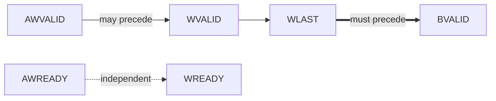
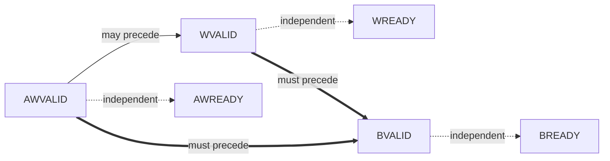

# Template: channel_handshake.md

**Primary audience:** BFM implementer, DV engineer auditing for deadlock conditions, RTL designer of the DUT facing the BFM.
**Goal:** Cross-channel dependencies and ordering rules are explicit, with diagrams. Catches the deadlock and out-of-order failure modes that single-channel rule tables miss.

**Protocol applicability:** Protocol-agnostic; applies to any multi-channel valid/ready handshake protocol (AXI, AXI-Lite, AHB, TileLink, CHI, custom). For single-channel protocols (APB, simple custom), this file collapses to a single transaction-type sub-section with no cross-channel dependencies. Mini-example uses AXI-Lite.

This file complements `protocol_rules.md`: where protocol_rules.md catalogs the per-channel rules formally (ID + Condition + Required behavior), this file catalogs the *between-channel* rules visually (dependency arrows) and narratively (ordering prose). Both are necessary — a deadlock-prone design satisfies every individual channel's rules and still hangs.

Format origin: ARM AMBA AXI Specification (IHI0022, §A2 Valid-Ready transport, channel handshake, dependencies).

## Required structure

```
# Channel Handshake & Dependencies

## Arrow convention

Per ARM AMBA AXI Specification §A3.3 (reuse for all handshake protocols):
- **Single-headed arrow** (`A --> B`): source signal at A *may* assert before destination signal at B. Permissive.
- **Double-headed arrow** (`A ==> B`): source signal at A *must* assert before destination signal at B. Mandatory; reversal is a protocol violation and must have a corresponding `XCH` rule in `protocol_rules.md`.

## Per-transaction-type dependencies

(One sub-section per transaction type. Most protocols have 2–3 transaction types: read, write, atomic. Some have more — list them all.)

### <Transaction type 1, e.g. Write transaction>

#### Dependency diagram



(Use `-->` for may-precede single-headed; use `==>` for must-precede double-headed; use `-. independent .->` for explicitly independent signals that share the diagram for context.)

#### Textual dependency list

One line per dependency. Format: `<signal A> assertion <may | must> precede <signal B> assertion`. Match the diagram.

- AWVALID assertion may precede WVALID assertion. (May start the address phase before the data phase, or simultaneously, or after — all legal.)
- AWVALID assertion may precede or follow AWREADY assertion. (Slave may ASSERT_READY-before-VALID; master may VALID-before-READY; both legal per AXI4-Lite §A3.3.)
- BVALID assertion must follow WLAST assertion. (Slave cannot respond before all write data has arrived. The corresponding protocol rule is `<PROTO>_<ROLE>_XCH_B_AFTER_W` in protocol_rules.md.)

#### Deadlock-avoidance commentary

If this transaction type has a known deadlock mode, describe it explicitly. Common forms:
- **Combinational ready loop**: if AWREADY depends combinationally on AWVALID, and the master drives AWVALID combinationally from AWREADY, the channel hangs. The BFM avoids this by registering AWREADY (state explicitly: "AWREADY is registered, never combinational on AWVALID").
- **Cross-channel back-pressure**: if the slave back-pressures W (holds WREADY low) until B is acked by the master, but the master holds BREADY low until W is acked by the slave, the channel hangs. State the BFM's policy explicitly (e.g., "WREADY is independent of BREADY; the BFM can accept all of W before any of B is acked").

If no deadlock mode applies, say so: "No known deadlock mode for this transaction type."

### <Transaction type 2, e.g. Read transaction>

(Same structure: dependency diagram, textual list, deadlock commentary.)

## Cross-transaction-type dependencies

If transaction types of different kinds have ordering relationships (e.g. "AXI3 requires write-then-read same-address ordering"), state them here. Most modern protocols have very few cross-transaction dependencies — empty section is acceptable, but state "(none)" rather than omitting.

## Out-of-order completion

State whether the BFM allows out-of-order completion *within* a transaction type:
- **AXI4 with ID-bearing channels**: yes, transactions with different IDs may complete out of order; same-ID transactions must complete in order.
- **AXI4-Lite**: no — only one outstanding transaction per direction; in-order trivially.
- **APB**: no — single-transaction-at-a-time.

If yes, state the BFM's ordering policy and reference the corresponding protocol_rules.md rules (typically `<PROTO>_<ROLE>_XCH_SAME_ID_ORDER` and `<PROTO>_<ROLE>_XCH_DIFF_ID_REORDER`).
```

## Writing rules for this file

1. **One diagram per transaction type.** Don't combine read and write into a single diagram — the result is unreadable. Per-transaction sub-sections; one Mermaid block per sub-section.
2. **Diagrams and textual lists are redundant on purpose.** The diagram is a quick scan; the textual list is greppable and mappable to protocol rules. Both are required. If you change the diagram and forget the list (or vice versa), you have introduced a drift; that's why both are required, so review catches it.
3. **Every "must precede" arrow has a corresponding `XCH` rule in `protocol_rules.md`.** The arrow is the visual aid; the rule is the testable predicate. They cross-reference.
4. **State deadlock policy explicitly, even when there is no risk.** "No known deadlock mode for this transaction type" is a useful statement — it commits the author to having considered the question. Silence is ambiguous.
5. **Independent signals appear in the diagram only when their independence is non-obvious.** AWREADY and WREADY are independent in AXI; that is non-obvious to a reader who has not internalized the spec, so include the dotted arrow. ACLK and ARESETn are independent in obvious ways; do not clutter the diagram.

## Anti-patterns

- **Anti-pattern:** A single dependency diagram covering all transaction types. Becomes a tangled hairball. Per-transaction-type sub-sections.
- **Anti-pattern:** Stating "the protocol handles this" without giving the dependency. The protocol *defines* the dependency; this file *records* it for the specific BFM. The reader should not have to consult the protocol spec to understand the BFM's behavior.
- **Anti-pattern:** Omitting the deadlock commentary when there is no deadlock mode. Stating "no known deadlock mode" forces the author to consider the question; omitting the section reads as "I didn't think about it."
- **Anti-pattern:** Cross-channel rules that exist in `protocol_rules.md` but are absent here, or vice versa. The two files must agree on the cross-channel relationships. Lint cannot enforce this fully — code review must.
- **Anti-pattern:** Mermaid arrow types that don't follow AXI convention. Using `-->` for must-precede and `==>` for may-precede inverts the standard meaning and breaks reader intuition for anyone familiar with the AXI spec.

## Mini-example: AXI-Lite slave BFM (write transaction only — read transaction follows the same shape)

```
# Channel Handshake & Dependencies

## Arrow convention

Per ARM AMBA AXI Specification §A3.3:
- Single-headed `-->`: may precede.
- Double-headed `==>`: must precede.

## Per-transaction-type dependencies

### Write transaction (AW + W → B)

#### Dependency diagram



#### Textual dependency list

- AWVALID assertion may precede WVALID assertion. (Master may start the address phase before, simultaneous with, or after the data phase.)
- AWVALID assertion may precede or follow AWREADY assertion. (Both VALID-before-READY and READY-before-VALID handshake orders are legal per AXI4-Lite §A3.3.)
- WVALID assertion may precede or follow WREADY assertion. (Same reasoning.)
- AWVALID handshake must precede BVALID assertion. The corresponding protocol rule is `AXI4LITE_SLV_XCH_B_AFTER_AW_AND_W` in protocol_rules.md.
- WVALID handshake must precede BVALID assertion. Same rule reference.
- BVALID assertion may precede or follow BREADY assertion.

#### Deadlock-avoidance commentary

The BFM avoids the AXI-Lite combinational-ready deadlock by **registering** AWREADY, WREADY, and BVALID. None of the BFM's READY/VALID outputs is a combinational function of an inbound VALID/READY input from the DUT. This is a hard rule for the BFM — see `theory_of_operation.md` §Internal architecture, which documents the registered output discipline.

The BFM does **not** chain AW and W back-pressure: WREADY is held low until the AW phase has completed for the corresponding write, which is necessary for AXI4-Lite's single-outstanding-write semantic, but WREADY is not gated by BREADY — the BFM accepts the W phase as soon as AW has completed, regardless of whether the previous B has been acked. This avoids the W↔B chain deadlock.

### Read transaction (AR → R)

(Same structure: dependency diagram, textual list, deadlock commentary.)

## Cross-transaction-type dependencies

(none — AXI4-Lite imposes no ordering between independent reads and writes.)

## Out-of-order completion

AXI4-Lite does not support outstanding transactions: one write and one read may be in flight, and they complete in the order they were issued. This BFM enforces single-outstanding semantics — a second write is back-pressured at AWREADY until the first write has completed (BVALID handshake). See protocol_rules.md `AXI4LITE_SLV_XCH_NO_OUTSTANDING_WRITE`.
```

That's the entire handshake contract for this transaction type — one diagram, six dependency lines, one paragraph of deadlock policy.
