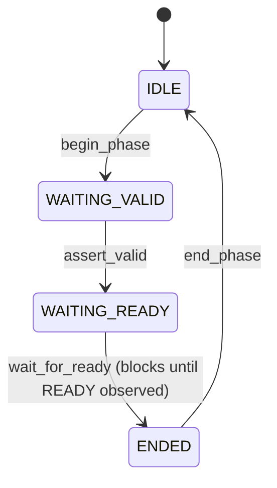

# Template: channel_api.md

**Primary audience:** Advanced test author writing out-of-order, interleave, fault-injection, or protocol-corner-case tests against the BFM. Used by ~5% of tests; required by every test that needs phase-level control.
**Goal:** Phase-level fine-grained control over individual handshake phases on each channel. Documents the per-phase tasks, ordering constraints, and what is legal to mix with the Transaction API.

**Protocol applicability:** Assumes a valid/ready handshake protocol with discrete channels. Covers AXI, AXI-Lite, AXI-Stream, AHB, TileLink, CHI, most modern custom protocols.

For **phase-based protocols without channels** (e.g., APB's SETUP/ACCESS phases), use a per-phase state machine instead of per-channel; method naming becomes `<verb>_<phase>` (e.g., `begin_phase_setup`, `assert_pready`, `end_phase_access` for APB). See `examples/apb_slave_bfm/doc/channel_api.md` for a worked phase-based reference.

For **strobe-based or other non-handshake protocols**, the per-channel-API-vs-Transaction-API split still applies, but the state machine and method names must be invented to fit the protocol.

Mini-example below uses AXI-Lite (channel-based, valid/ready).

This file complements `transaction_api.md`. Most tests use only `transaction_api.md` and never see this file; the small minority that need to drive AW without W (to test slave back-pressure recovery), or assert WVALID for an extended interval (to test protocol-rule timeout behavior), or inject illegal handshake sequences (to test protocol-checker assertions in the DUT) need the channel API.

Modeled on the OSVVM Channel API and Aldec/Cadence three-layer separation. The strict separation of Transaction and Channel API is what makes the BFM usable for both routine tests (Transaction API only) and corner-case tests (Channel API).

## Required structure

```
# Channel API

## When to use this API

State the criteria explicitly. The default expectation is "use transaction_api.md instead." Document the exceptions:
- <e.g. "Driving AW without a corresponding W (slave back-pressure recovery test)">
- <e.g. "Holding WVALID asserted for N cycles before WREADY appears (protocol-rule timeout test)">
- <e.g. "Injecting illegal handshake sequences against the DUT (DUT protocol-checker assertion test)">

## API conventions

- Method naming, choose one and state at the top of this file:
  - **Per-channel** (channel-based protocols like AXI): `<verb>_<channel>(<args>)` — e.g. `begin_phase_AW`, `assert_valid_W`, `wait_for_ready_B`.
  - **Per-phase** (phase-based protocols like APB): `<verb>_<phase>(<args>)` — e.g. `begin_phase_setup`, `assert_pready`, `end_phase_access`.
  - **Unified with parameter**: `begin_phase(channel_or_phase=AW, ...)` — acceptable but verbose.
- Naming: snake_case throughout.
- Error reporting: same `status_t` enum as transaction_api.md; per-channel/phase methods return `OK` or `ILLEGAL_PHASE` (attempted to advance a phase that hasn't been begun).
- Blocking discipline: `wait_for_*` methods block; all others are non-blocking (return on the same testbench cycle they're called).

## Channel state machine

For each channel, state the phase progression. Channel-API methods drive transitions in this state machine; legality of each call depends on the channel's current state.



(One diagram per channel, or one diagram if all channels share the same state machine. State the per-channel deviations if any.)

## Per-channel API

(One sub-section per channel listed in signal_interface.md §Channel grouping.)

### <Channel name>

| Method | Signature | Legal in state | Side effect | Returns |
|--------|-----------|----------------|-------------|---------|
| begin_phase_<chan>(<fields>)   | <signature>   | IDLE           | <wires driven, state transition> | <return type> |
| assert_valid_<chan>()           | void          | WAITING_VALID  | <chan>VALID asserted             | OK or ILLEGAL_PHASE |
| wait_for_ready_<chan>()         | status_t      | WAITING_READY  | blocks until <chan>READY observed | OK or RESET_DURING_TRANSACTION |
| end_phase_<chan>()              | void          | ENDED          | de-assert outputs; transition IDLE | OK or ILLEGAL_PHASE |

For each method, state the side effect at wire level. Example for `begin_phase_AW(addr, prot)`:
- AWADDR is driven to addr.
- AWPROT is driven to prot.
- AWVALID remains 0; the caller must call assert_valid_AW to drive it HIGH.

### <Next channel>

(Same structure.)

## Ordering constraints with Transaction API

State the rules for mixing Channel API and Transaction API on the same channels:

- **Forbidden mixing**: list the patterns that produce undefined behavior. Typical: "Transaction API call begun ⇒ Channel API on the same channel forbidden until the Transaction API call returns."
- **Permitted mixing**: list patterns that are explicitly legal. Typical: "Channel API on AW + Transaction API on AR concurrently is legal — the channels are independent."
- **Detection**: how the BFM detects illegal mixing. Typical: "Channel API methods called on a channel currently held by a Transaction API call return `BUSY_TXN_API`; the call has no side effect."

## Behavior under reset

State what every Channel API method does when the protocol reset signal asserts:
- <e.g. "Per-channel state machines are reset to IDLE; in-progress wait_for_ready calls are unblocked with status RESET_DURING_TRANSACTION; outstanding configuration is preserved.">

## Concurrency rules

State what is and is not safe to call concurrently:
- <e.g. "Per-channel methods on different channels may be called concurrently from separate threads. Methods on the same channel must be called from a single thread (the channel state machine is not thread-safe).">
```

## Writing rules for this file

1. **State the channel state machine first.** Without it, the per-channel method tables are uninterpretable. The state machine is short — typically 4–5 states — and applies uniformly across most channels of most protocols.
2. **The "Legal in state" column is a hard precondition.** Calling `assert_valid_AW` while AW is in state IDLE is illegal — the BFM must return `ILLEGAL_PHASE` and have no side effect. If the table column is empty for a method, that method has no state precondition and is legal in any state.
3. **Side effects are wire-level.** Same rule as transaction_api.md: do not describe internal implementation. State which wires are driven to what value.
4. **Forbidden mixing is enumerated explicitly.** "Transaction API and Channel API don't mix" is too vague. Spell out which methods on which channels block which other methods on which channels.
5. **Channel API methods are non-blocking by default.** The exception is `wait_for_*`, which is blocking by name. Do not introduce hidden blocking on other methods — that defeats the API's purpose (which is fine-grained control over timing).

## Anti-patterns

- **Anti-pattern:** Channel API methods that "wrap" multiple phases. `do_aw_phase(addr)` that begins, asserts valid, waits for ready, and ends in one call is not a Channel API method — it is a Transaction API method in disguise. Decompose to one phase per method, or move it to transaction_api.md.
- **Anti-pattern:** Per-channel state machines that diverge without explanation. If AW uses a 4-state machine and W uses a 5-state machine, document why.
- **Anti-pattern:** Allowing arbitrary mixing of Channel API and Transaction API. Mixing is fundamentally racy; "anything goes" mixing rules guarantee user bugs. Define a strict ownership model: when one API "owns" a channel, the other returns BUSY.
- **Anti-pattern:** Channel-API methods whose names overlap with Transaction-API methods. Both APIs in the same namespace (e.g. `apply_write` in both) is a recipe for confusion. Use distinct prefixes or separate namespaces.
- **Anti-pattern:** Documenting only the methods, not the state machine. Without the state machine, the legality column ("Legal in state: WAITING_VALID") references something the reader has not been told about.

## Mini-example: AXI-Lite slave BFM Channel API (AW channel only — full file enumerates W, B, AR, R)

```
# Channel API

## When to use this API

Use the Channel API when the test needs:
- To assert AWREADY without an accompanying matching response promise (slave back-pressure recovery).
- To hold WREADY low for an extended interval to verify the master DUT's protocol-rule timeout behavior.
- To inject an illegal handshake sequence (e.g., assert BVALID before any AW handshake) to verify the DUT's protocol-checker assertions catch it.

Otherwise use transaction_api.md — it is shorter, less error-prone, and covers the typical 95% of tests.

## API conventions

- Per-channel methods named `<verb>_<channel>` — e.g. `begin_phase_AW`, `assert_valid_AW`, `wait_for_ready_AW`, `end_phase_AW`.
- Naming: snake_case.
- Error reporting: status_t enum; per-channel methods return `OK`, `ILLEGAL_PHASE`, `BUSY_TXN_API`, or `RESET_DURING_TRANSACTION`.
- Blocking discipline: only `wait_for_ready_*` methods block.

## Channel state machine


All five AXI-Lite channels (AW, W, B, AR, R) use this state machine. The slave BFM drives the READY signals on inbound channels (AW, W, AR) and the VALID signals on outbound channels (B, R); for inbound channels, `assert_valid` is replaced by `assert_ready`, but otherwise the state machine is identical.

## Per-channel API

### AW (write address; inbound to slave BFM)

| Method                                | Signature                          | Legal in state | Side effect                                                               | Returns                          |
|---------------------------------------|------------------------------------|----------------|---------------------------------------------------------------------------|----------------------------------|
| begin_phase_AW()                      | void                               | IDLE           | Transition to WAITING_VALID. No wires driven (AW is inbound; the BFM drives only AWREADY).| OK or BUSY_TXN_API |
| assert_ready_AW()                     | void                               | WAITING_VALID  | AWREADY driven HIGH on the next ACLK rising edge. State → WAITING_READY.   | OK or ILLEGAL_PHASE              |
| wait_for_valid_AW(addr_match=<opt>)   | status_t (addr, prot)              | WAITING_READY  | Blocks until AWVALID is observed HIGH on a rising ACLK edge with AWADDR matching addr_match (if specified). State → ENDED. Returns observed (addr, prot) tuple. | OK or RESET_DURING_TRANSACTION |
| end_phase_AW()                        | void                               | ENDED          | AWREADY driven LOW on the next ACLK rising edge. State → IDLE.             | OK or ILLEGAL_PHASE              |

`begin_phase_AW` returns `BUSY_TXN_API` if a Transaction API call (e.g. `expect_write`) is currently waiting on the AW channel.

### W

(Same shape: begin_phase_W, assert_ready_W, wait_for_valid_W, end_phase_W.)

### B (write response; outbound from slave BFM)

| Method                          | Signature                       | Legal in state | Side effect                                                | Returns                          |
|---------------------------------|---------------------------------|----------------|------------------------------------------------------------|----------------------------------|
| begin_phase_B(BRESP)            | void(uint2_t)                   | IDLE           | BRESP driven to the supplied value on the next ACLK edge. State → WAITING_VALID. | OK or BUSY_TXN_API |
| assert_valid_B()                | void                            | WAITING_VALID  | BVALID driven HIGH. State → WAITING_READY.                                       | OK or ILLEGAL_PHASE |
| wait_for_ready_B()              | status_t                        | WAITING_READY  | Blocks until BREADY observed HIGH. State → ENDED.                                | OK or RESET_DURING_TRANSACTION |
| end_phase_B()                   | void                            | ENDED          | BVALID driven LOW; BRESP held until next begin_phase_B. State → IDLE.            | OK or ILLEGAL_PHASE |

(AR mirrors AW; R mirrors B.)

## Ordering constraints with Transaction API

- **Forbidden**: any Channel API method on a channel that is currently being driven by a Transaction API call. Specifically: while `expect_write` is blocked, the AW, W, and B channels are owned by the Transaction API; Channel API methods on those channels return `BUSY_TXN_API`.
- **Permitted**: Channel API on AR/R while `expect_write` is blocked on AW/W/B is legal — the channels are independent.
- **Detection**: every Channel API method checks the per-channel ownership flag before acting. The BFM logs the BUSY_TXN_API return so user bugs are visible.

## Behavior under reset

ARESETn asserts → all channel state machines reset to IDLE → any blocked `wait_for_*` calls unblock with status `RESET_DURING_TRANSACTION` → outstanding `begin_phase_B(BRESP)` field configurations are dropped → on ARESETn deassertion, the channels are clean and ready for the next phase.

## Concurrency rules

Per-channel methods on different channels may be called concurrently from separate testbench threads. Per-channel methods on the same channel must be called from a single thread; the channel's state machine is not thread-safe and concurrent calls produce undefined behavior (no error returned, but state transitions race).
```

That's the full Channel API contract for the AW channel — one state machine, four methods in a table, ordering rules vs Transaction API.
